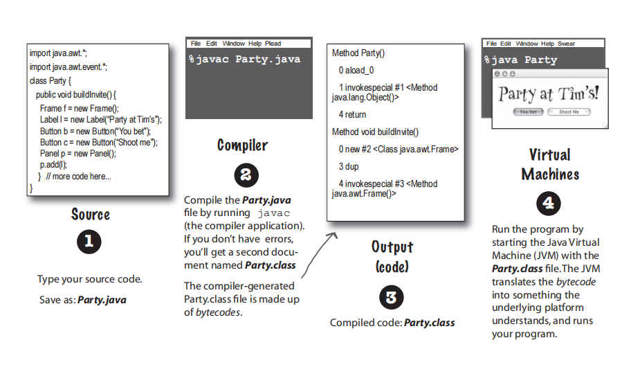

# Cha1-Breaking the Surface

+ Java的工作方式
    + 源代码 .java-->经过javac编译成.class 文件-->最后在虚拟机上运行

+ Java 版本
    + Java 1.02
    + Java 1.1
    + Java 2(Versions 1.2-1.4)
    + Java 5.0(Versions 1.5 and up)
+ 补充1
    + JDK --- Java Development Kit
    + JRE -- - Java Runtime Environment
    + JVM --- Java Virtual Machine
+ 补充2
    + JDK = JRE + 开发工具集(javac, java编译工具等)
    + JRE = JVM + Java SE标准类库