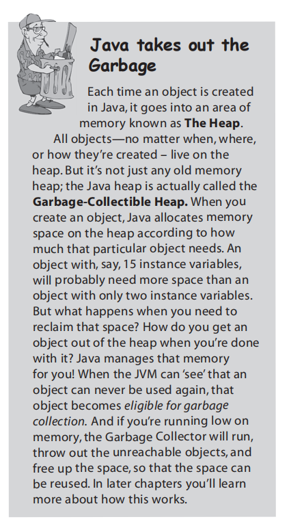

# Cha2-A trip to objectville

+ 首先讨论了面向对象编程和面向过程编程对于椅子这一特定问题的不同解决模式
    + 面向对象编程模块化、方便后续添加、更改需求
    
+ 概念
    + instance variable
    + method
        + local variable
    
+ Class vs Object

+ main函数的作用
    + to test your real class
    + to launch/start your Java application
    
+ Java takes out of the Garbage(简述)

    

    