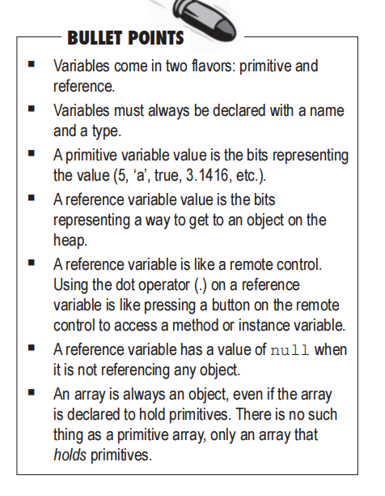

# Cha3-Know your variables

+ Java cares about type

    ```java
    //primitive variable
    byte x = 7
    //reference variable
    Dog d = new Dog()
    ```

+ 3 steps of object declaration, creation and assignment

    + Declare a reference variable
    + Create an object
    + Link the object and the reference

+ Life on the garbage-collectible heap

    + 课本p 57 58

+ Array
    + 课本 p 60

+ 总结

    

    