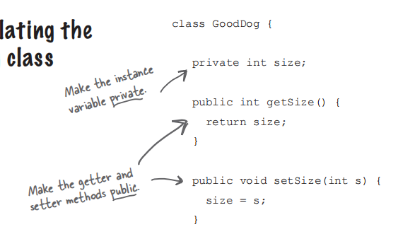
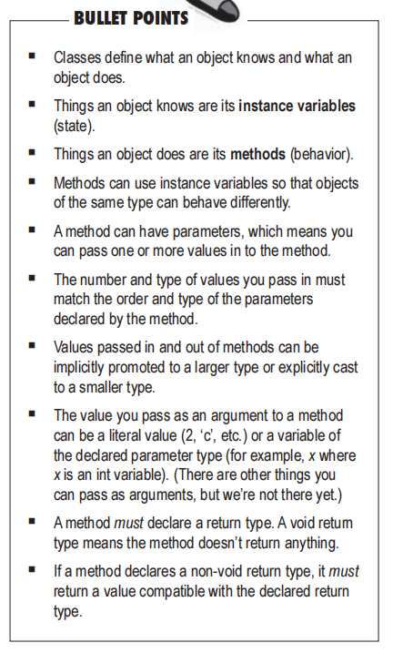

# Cha4 How objects behave

+ a class describe what an object knows and what an object does

    + knows --- instance variable
    + does --- method

+ parameter/argument

    + A method uses parameter. 
    + A caller passes argument

    ```java
    void bark(int numOfBarks){	//parameters
      ...
    }
    ```

    ```java
    Dog d = new Dog();
    d.bark(3)	//argument
    ```

+ Java is pass - by - value

    + pass - by - value

+ method 如果设定返回值，则在方法最后必须要有返回值。但使用时不一定有变量接收

+ Encapsulation

    

+ default value
    + Instance variables always get a default value
    + Local variables do not get a default value. The compiler will complain if you try to use a local variable before the variable is initialized
+ **Comparing variables**
    + ==
        + compare primitives or to see if two references refer to the same object
    + equals()
        + to see if two different objects are equal
            + such as two different String objects that both represent "hello"

+ Summary

    